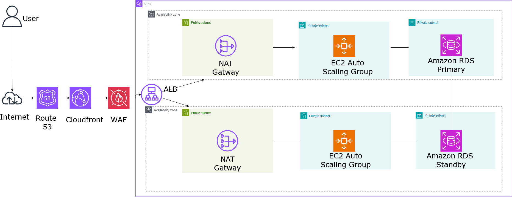

# aws-scalable-web-app
Multi-AZ Scalable Web Application with ALB, Auto Scaling, and RDS

# AWS Multi-AZ Scalable Web Application Architecture

## 📌 Overview
This project presents a production-grade, highly available, and auto-scaling web application built on AWS. It uses a Multi-AZ VPC design to ensure maximum fault tolerance, security, and low latency for web traffic.

---

## 🏗 Solution Architecture Diagram

---

## 🛠 Key AWS Services Used
- **VPC**: 2 Availability Zones, 2 Public Subnets, 4 Private Subnets, 1 NAT Gateway
- **EC2 & Auto Scaling Group**: Dynamic capacity scaling based on CPU utilization metrics
- **Application Load Balancer (ALB) & WAF**: Layer 7 traffic routing and OWASP Top 10 security rules
- **RDS Multi-AZ**: High-availability database backend with automated failover
- **CloudFront**: Edge content delivery for low-latency asset caching
- **Systems Manager**: Bastion-less instance access using Session Manager
- **CloudWatch & SNS**: Automated CPU monitoring alarms and email alerts

---

## 🚀 Setup & Deployment
1. **Network Provisioning**: Configure the custom VPC, subnets, route tables, and Internet/NAT Gateways.
2. **Database Layer**: Deploy a Multi-AZ MySQL RDS instance across private database subnets.
3. **Compute & Load Balancing**: 
   - Deploy an ALB in public subnets.
   - Configure a Launch Template using `./scripts/user-data.sh`.
   - Create an Auto Scaling Group in private compute subnets attached to the ALB target group.
4. **Security & CDN**: Attach AWS WAF to the ALB and configure a CloudFront distribution for edge caching.

---

## 🧪 Testing & Validation
- **High Availability Verification**: Terminated an EC2 instance manually; ASG automatically replaced it with zero downtime.
- **Failover Validation**: Initiated manual failover on the primary RDS instance; traffic failed over to the standby node seamlessy.
- **Auto Scaling Trigger**: Simulated CPU spikes using `stress` utility to trigger scale-out policies.

